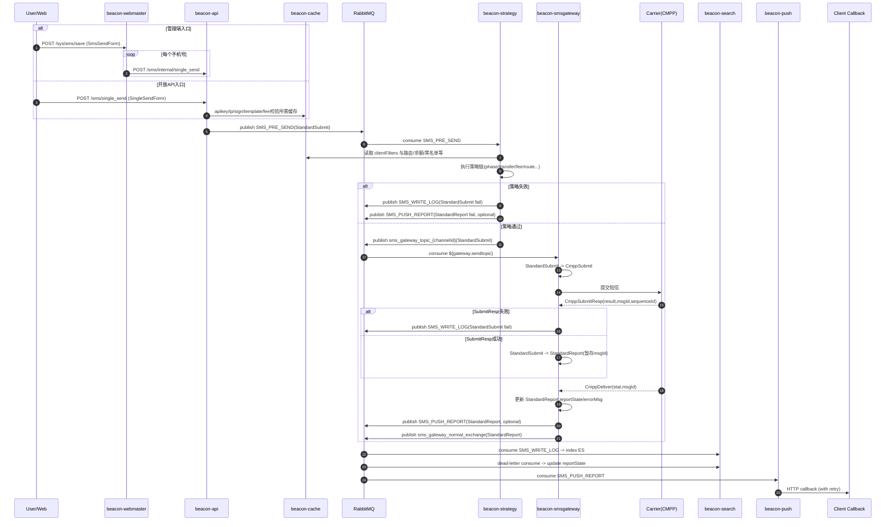

# beacon-cloud 短信发送链路深度分析（标准提交对象追踪）

## 0. 分析范围与结论先行

本报告基于当前仓库代码静态分析（截至 2026-02-27），覆盖短信发送主链路相关微服务：
- `beacon-webmaster`（管理端入口，可选上游）
- `beacon-api`（短信 API 入口）
- `beacon-cache`（缓存读写服务）
- `beacon-strategy`（策略编排与路由）
- `beacon-smsgateway`（CMPP 网关）
- `beacon-search`（写 ES 日志与状态更新）
- `beacon-push`（状态回调推送）

核心结论：
1. 当前系统“标准提交对象”以 `StandardSubmit` 为主线，在网关上行响应后衍生为 `StandardReport`，再分流到搜索更新与回调推送。
2. 链路为典型异步最终一致架构（RabbitMQ + 多消费者），没有跨服务强事务。
3. 存在一处高风险字段映射隐患：`apiKey` -> `apikey` 通过 `BeanUtils.copyProperties` 可能发生静默丢字段，影响网关回执后的回调判定。

---

## 一、完整调用链路分析（Workflow Analysis）

### 1.1 入口链路总览

系统存在两条入口，后半段在 `beacon-api` 之后汇合：

- 管理端入口（控制台发送）
  - `beacon-webmaster` `POST /sys/sms/save`（或 `/sys/sms/update`）
  - 逐手机号调用 `beacon-api` `POST /sms/internal/single_send`
- 开放 API 入口（对外）
  - 直接调用 `beacon-api` `POST /sms/single_send`

两条入口均进入 `StandardSubmit`，并发布到 `sms_pre_send_topic`，随后由策略模块消费。

### 1.2 端到端调用步骤（主干 + 分支）

1. 入口接收请求
- 管理端：`SysSmsController` 接收 `SmsSendForm`，`SmsManageServiceImpl` 解析批量手机号，组装 `ApiInternalSingleSendForm` 并逐条调用 `beacon-api` 内部接口。
- 开放 API：`SmsController.singleSend` 接收 `SingleSendForm`。

2. API 模块构建标准提交对象
- `SmsController.buildSubmit(...)` 组装 `StandardSubmit`：`apiKey/clientId/mobile/text/state/uid/realIp`。
- `enqueue(...)` 补充 `sequenceId`、`sendTime`，发 MQ 到 `SMS_PRE_SEND`。
- 对外接口会先执行 `CheckFilterContext`（默认 `apikey,ip,sign,template`，可由配置扩展）并在链路内补齐 `clientId/ip/sign/signId`（若启用 `fee` 过滤器还会补 `fee`）；内部接口默认绕过该校验链。

3. 策略模块消费与编排
- `PreSendListener` 消费 `SMS_PRE_SEND`，进入 `StrategyFilterContext`。
- `StrategyFilterContext` 从缓存 `clientFilters` 读取执行链顺序，逐个执行策略。
- 典型策略字段变化：
  - `phase`：补 `area/operatorId`
  - `transfer`：改写 `operatorId`，置 `isTransfer=true`
  - `fee`：执行余额扣减（依赖 `fee` 字段）
  - `route`：补 `channelId/srcNumber`，并投递到 `sms_gateway_topic_{channelId}`
- 任一策略失败时，调用 `ErrorSendMsgUtil`：
  - `StandardSubmit.reportState=FAIL`
  - 发送 `SMS_WRITE_LOG`（写日志）
  - 视客户配置发送 `SMS_PUSH_REPORT`（失败回调）

4. 网关模块与外部运营商交互
- `SmsGatewayListener` 监听 `${gateway.sendtopic}` 队列（通常应对应某个 `sms_gateway_topic_{channelId}`）。
- 将 `StandardSubmit` 转换为 `CmppSubmit` 协议对象并发起 Netty CMPP 提交。
- 维护两段临时映射：
  - `sequenceId -> StandardSubmit`（等待 SubmitResp）
  - `msgId -> StandardReport`（等待 Deliver 状态报告）

5. 运营商两次回执处理
- 第一次回执 `CmppSubmitResp`
  - 失败：在 `StandardSubmit` 上补 `reportState/errorMsg`，发 `SMS_WRITE_LOG`
  - 成功：由 `StandardSubmit` 复制得到 `StandardReport`，暂存 `msgId -> report`
- 第二次回执 `CmppDeliver`
  - 根据 `stat` 将 `StandardReport.reportState` 置成功/失败并补 `errorMsg`
  - 若客户开启回调，发 `SMS_PUSH_REPORT`
  - 同时发 `sms_gateway_normal_exchange`，经 TTL + 死信队列驱动搜索模块“延迟状态更新”

6. 搜索与回调终点
- `beacon-search`：
  - `SmsWriteLogListener` 将 `StandardSubmit` 写入 ES 索引 `sms_submit_log_{year}`
  - `SmsUpdateLogListener` 从死信队列消费 `StandardReport`，更新 ES 文档 `reportState`
- `beacon-push`：
  - `PushReportListener` 消费 `SMS_PUSH_REPORT`，HTTP POST 到客户 `callbackUrl`
  - 失败时进入延迟交换机重试（最多 5 次）

### 1.3 涉及微服务模块与职责

| 微服务模块 | 角色职责 | 关键类 |
|---|---|---|
| `beacon-webmaster` | 管理端短信发送入口、批量拆分与内部调用聚合 | `SysSmsController`, `SmsManageServiceImpl`, `ApiSmsClient` |
| `beacon-api` | 统一短信提交入口、参数校验、标准对象构建、投递预发送队列 | `SmsController`, `CheckFilterContext`, `*CheckFilter` |
| `beacon-cache` | Redis 访问服务，承载客户端配置、签名模板、余额、路由信息 | `CacheController` |
| `beacon-strategy` | 动态策略链执行、风控与路由、失败分流 | `PreSendListener`, `StrategyFilterContext`, `*StrategyFilter`, `ErrorSendMsgUtil` |
| `beacon-smsgateway` | Rabbit->CMPP 协议转换、运营商提交、双回执处理 | `SmsGatewayListener`, `NettyClient`, `CMPPHandler`, `SubmitRepoRunnable`, `DeliverRunnable` |
| `beacon-search` | 短信提交日志写 ES、状态回写更新 | `SmsWriteLogListener`, `SmsUpdateLogListener`, `ElasticsearchServiceImpl` |
| `beacon-push` | 状态回调 HTTP 推送与延迟重试 | `PushReportListener` |
| 外部系统 | 运营商 CMPP 网关、客户回调服务 | CMPP Provider / Client Callback API |

### 1.4 Sequence Diagram（Mermaid）

---

## 二、核心 Class 跨服务形态追踪（Data Model Lifecycle）

> 说明：下面重点追踪“标准提交对象”及其衍生对象在链路中的形态变化。

| 所在微服务/模块 | 所在架构层级 | 具体 Class 名称 | 数据形态/核心字段（新增、隐藏、转换） |
|---|---|---|---|
| `beacon-webmaster` | Controller 入参层 | `SmsSendForm` | 管理端表单：`clientId/mobile/content/state`。仍是“业务输入形态”，未包含 `apiKey/sequenceId/sendTime`。 |
| `beacon-webmaster` | Service 调用层 | `ApiInternalSingleSendForm` | 按手机号拆分后的内部调用 DTO：`apikey/mobile/text/uid/state/realIp`。新增 `uid`（`buildUid`）和 `realIp`。 |
| `beacon-api` | Controller 入参层 | `InternalSingleSendForm` / `SingleSendForm` | 内部/外部请求对象。外部 `SingleSendForm` 偏公开参数；内部表单多 `realIp`。 |
| `beacon-api` | Controller 组装层 | `StandardSubmit`（初始态） | `buildSubmit` 写入：`apiKey/clientId/mobile/text/state/uid/realIp`。此时 `sequenceId/sendTime/channelId/srcNumber` 均为空。 |
| `beacon-api` | 校验过滤层（仅外部接口默认执行） | `StandardSubmit`（校验增强态） | `ApiKeyCheckFilter` 补 `clientId`；`IPCheckFilter` 补 `ip` 白名单；`SignCheckFilter` 补 `sign/signId`；若启用 `fee` 过滤器则计算 `fee`。失败直接抛异常，不入 MQ。 |
| `beacon-api` | 消息投递层 | `StandardSubmit`（入队态） | `enqueue` 补 `sequenceId`（雪花 ID）+ `sendTime`，发布到 `SMS_PRE_SEND`。对调用方回包 `uid/sid`。 |
| RabbitMQ | 消息传输层 | `StandardSubmit` JSON | 通过 `Jackson2JsonMessageConverter` 跨服务传输。保持对象字段结构（含 `LocalDateTime`）。 |
| `beacon-strategy` | MQ 消费 + 业务编排层 | `StandardSubmit`（策略演进态） | 按 `clientFilters` 动态串行修改：`phase` 补 `area/operatorId`；`transfer` 可能改 `operatorId` 且置 `isTransfer=true`；`route` 补 `channelId/srcNumber`；失败时补 `errorMsg/reportState=2` 并分流。 |
| `beacon-strategy` | 失败分流层 | `StandardSubmit` -> `StandardReport` | `ErrorSendMsgUtil` 先把 `StandardSubmit` 写日志，再在需要回调时 `BeanUtils.copyProperties` 复制成 `StandardReport`，并补 `isCallback/callbackUrl`。 |
| `beacon-smsgateway` | MQ 消费适配层 | `StandardSubmit` -> `CmppSubmit` | 协议转换：抽取 `srcNumber/mobile/text` + 生成 `sequence`，构造 `CmppSubmit`（CMPP 二进制协议对象）；并暂存 `sequence->StandardSubmit`。 |
| `beacon-smsgateway` | 运营商首回执层 | `CmppSubmitResp` + `StandardSubmit` | `SubmitRepoRunnable` 取回原 `StandardSubmit`。失败：写 `reportState/errorMsg` 后发 `SMS_WRITE_LOG`；成功：复制为 `StandardReport`，暂存 `msgId->report`。 |
| `beacon-smsgateway` | 运营商终回执层 | `CmppDeliver` + `StandardReport` | `DeliverRunnable` 取回 `StandardReport`，按 `stat` 补最终 `reportState/errorMsg`；若需回调则补 `isCallback/callbackUrl` 并发 `SMS_PUSH_REPORT`。 |
| `beacon-search` | 日志落地层 | `StandardSubmit` -> `Map<String,Object>` | `SmsWriteLogListener` 用 `ObjectMapper.convertValue` 转 `Map`，新增 `sendTimeMillis` 字段，写 ES 索引 `sms_submit_log_{year}`。 |
| `beacon-search` | 状态回写层 | `StandardReport` -> `Map<String,Object>` | `SmsUpdateLogListener` 仅提取 `reportState` 更新 ES 文档（按 `sequenceId`）。 |
| `beacon-push` | 回调推送层 | `StandardReport` JSON | 直接序列化为 JSON POST 到客户 `callbackUrl`；失败累计 `resendCount` 并进入延迟队列重试。 |

### 2.1 `StandardSubmit` 字段演变重点

- 入口构建阶段（API）
  - 已有：`apiKey/clientId/mobile/text/state/uid/realIp`
  - 未有：`fee/sign/signId/area/operatorId/channelId/srcNumber/reportState/errorMsg`
- API 校验链后（外部入口）
  - 新增/补齐：`clientId/ip/sign/signId`（若启用 `fee` 过滤器则补 `fee`）
- 策略链后
  - 新增/改写：`area/operatorId/isTransfer/channelId/srcNumber`
- 失败分支
  - 新增：`reportState=2`、`errorMsg`
- 网关后续
  - `StandardSubmit` 不再继续扩展，主要衍生为 `StandardReport` 进入状态回执与回调链路

---

## 三、架构师建议（Architectural Insights）

### 3.1 字段映射 / 对象拷贝风险评估

1. `BeanUtils.copyProperties` 在主链路上存在“静默丢字段”高风险
- 现状：`StandardSubmit` 字段名为 `apiKey`，`StandardReport` 字段名为 `apikey`。
- 两处复制都使用 `BeanUtils.copyProperties(submit, report)`，不会显式报错。
- 后果：`DeliverRunnable` 依赖 `report.getApikey()` 查询回调配置，若该字段未复制成功，终态回调可能被跳过。
- 建议：
  - 统一命名（建议全部使用 `apiKey`）。
  - 或改为显式映射（手工赋值/MapStruct），禁止关键字段“约定式反射复制”。

2. 高频路径有多次反射/二次序列化开销
- 现状：`SmsWriteLogListener` 每条消息 `new ObjectMapper()` 并 `convertValue` 后再 `JsonUtil.toJson`。
- 风险：高吞吐下 GC 压力和 CPU 开销偏高。
- 建议：注入单例 `ObjectMapper`，并避免 `Map -> JSON` 的中间态重复转换。

### 3.2 链路健壮性优化建议（建议优先做 2 条）

1. 引入“扣费-发送”一致性补偿，避免失败后余额与发送状态不一致
- 现状：`fee` 策略先扣费，后续 `route` 或网关提交失败时未见统一补偿事务。
- 风险：出现“扣费成功但未发送成功”的资金与业务状态偏差。
- 落地建议：
  - 采用本地事务 + Outbox/Event（扣费事件、发送事件分离可追踪）。
  - 以 `sequenceId` 建立可补偿流水，发送失败触发自动回滚或人工对账队列。

2. 全链路引入幂等键与去重语义，降低 MQ 重投/重复消费副作用
- 现状：链路主要依赖 RabbitMQ 手动 ack，ES 写入要求 `CREATED`，重复消息可能触发异常重试风暴。
- 风险：重复消息导致索引更新异常、重复回调、状态抖动。
- 落地建议：
  - 统一以 `sequenceId` 作为幂等主键；ES 写入改为 upsert 语义（接受 CREATED/UPDATED）。
  - 回调请求增加签名 + 幂等头（如 `X-Sms-Sequence-Id`），客户端可安全去重。

---

## 附：关键代码定位（便于二次审计）

- 入口与标准对象构建
  - `beacon-api/src/main/java/com/cz/api/controller/SmsController.java`
  - `beacon-webmaster/src/main/java/com/cz/webmaster/controller/SysSmsController.java`
  - `beacon-webmaster/src/main/java/com/cz/webmaster/service/impl/SmsManageServiceImpl.java`
- 标准对象定义
  - `beacon-common/src/main/java/com/cz/common/model/StandardSubmit.java`
  - `beacon-common/src/main/java/com/cz/common/model/StandardReport.java`
- 策略编排与失败分流
  - `beacon-strategy/src/main/java/com/cz/strategy/mq/PreSendListener.java`
  - `beacon-strategy/src/main/java/com/cz/strategy/filter/StrategyFilterContext.java`
  - `beacon-strategy/src/main/java/com/cz/strategy/filter/impl/RouteStrategyFilter.java`
  - `beacon-strategy/src/main/java/com/cz/strategy/util/ErrorSendMsgUtil.java`
- 网关协议转换与回执
  - `beacon-smsgateway/src/main/java/com/cz/smsgateway/mq/SmsGatewayListener.java`
  - `beacon-smsgateway/src/main/java/com/cz/smsgateway/runnable/SubmitRepoRunnable.java`
  - `beacon-smsgateway/src/main/java/com/cz/smsgateway/runnable/DeliverRunnable.java`
- 日志落地与回调
  - `beacon-search/src/main/java/com/cz/search/mq/SmsWriteLogListener.java`
  - `beacon-search/src/main/java/com/cz/search/mq/SmsUpdateLogListener.java`
  - `beacon-push/src/main/java/com/cz/push/mq/PushReportListener.java`

## 附2：关键证据行号（精选）

- 管理端入口与内部调用
  - `beacon-webmaster/src/main/java/com/cz/webmaster/controller/SysSmsController.java:15`
  - `beacon-webmaster/src/main/java/com/cz/webmaster/controller/SysSmsController.java:24`
  - `beacon-webmaster/src/main/java/com/cz/webmaster/service/impl/SmsManageServiceImpl.java:129`
  - `beacon-webmaster/src/main/java/com/cz/webmaster/service/impl/SmsManageServiceImpl.java:138`
  - `beacon-webmaster/src/main/java/com/cz/webmaster/client/ApiSmsClient.java:16`

- API 入口、标准对象构建与入队
  - `beacon-api/src/main/java/com/cz/api/controller/SmsController.java:62`
  - `beacon-api/src/main/java/com/cz/api/controller/SmsController.java:79`
  - `beacon-api/src/main/java/com/cz/api/controller/SmsController.java:115`
  - `beacon-api/src/main/java/com/cz/api/controller/SmsController.java:103`
  - `beacon-api/src/main/java/com/cz/api/controller/SmsController.java:106`

- API 校验链补字段
  - `beacon-api/src/main/java/com/cz/api/filter/CheckFilterContext.java:26`
  - `beacon-api/src/main/java/com/cz/api/filter/impl/ApiKeyCheckFilter.java:40`
  - `beacon-api/src/main/java/com/cz/api/filter/impl/IPCheckFilter.java:36`
  - `beacon-api/src/main/java/com/cz/api/filter/impl/SignCheckFilter.java:68`
  - `beacon-api/src/main/java/com/cz/api/filter/impl/FeeCheckFilter.java:46`

- 策略链、路由与失败分流
  - `beacon-strategy/src/main/java/com/cz/strategy/mq/PreSendListener.java:26`
  - `beacon-strategy/src/main/java/com/cz/strategy/filter/StrategyFilterContext.java:31`
  - `beacon-strategy/src/main/java/com/cz/strategy/filter/impl/PhaseStrategyFilter.java:101`
  - `beacon-strategy/src/main/java/com/cz/strategy/filter/impl/RouteStrategyFilter.java:102`
  - `beacon-strategy/src/main/java/com/cz/strategy/filter/impl/RouteStrategyFilter.java:111`
  - `beacon-strategy/src/main/java/com/cz/strategy/util/ErrorSendMsgUtil.java:27`
  - `beacon-strategy/src/main/java/com/cz/strategy/util/ErrorSendMsgUtil.java:45`

- 网关协议转换与回执
  - `beacon-smsgateway/src/main/java/com/cz/smsgateway/mq/SmsGatewayListener.java:31`
  - `beacon-smsgateway/src/main/java/com/cz/smsgateway/mq/SmsGatewayListener.java:42`
  - `beacon-smsgateway/src/main/java/com/cz/smsgateway/mq/SmsGatewayListener.java:44`
  - `beacon-smsgateway/src/main/java/com/cz/smsgateway/runnable/SubmitRepoRunnable.java:57`
  - `beacon-smsgateway/src/main/java/com/cz/smsgateway/runnable/DeliverRunnable.java:59`
  - `beacon-smsgateway/src/main/java/com/cz/smsgateway/runnable/DeliverRunnable.java:74`

- 搜索与回调终点
  - `beacon-search/src/main/java/com/cz/search/mq/SmsWriteLogListener.java:34`
  - `beacon-search/src/main/java/com/cz/search/mq/SmsWriteLogListener.java:42`
  - `beacon-search/src/main/java/com/cz/search/service/impl/ElasticsearchServiceImpl.java:69`
  - `beacon-search/src/main/java/com/cz/search/service/impl/ElasticsearchServiceImpl.java:107`
  - `beacon-push/src/main/java/com/cz/push/mq/PushReportListener.java:53`
  - `beacon-push/src/main/java/com/cz/push/mq/PushReportListener.java:81`
  - `beacon-push/src/main/java/com/cz/push/mq/PushReportListener.java:110`

